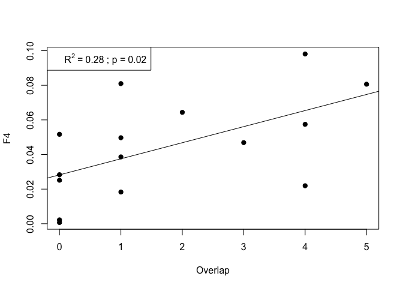
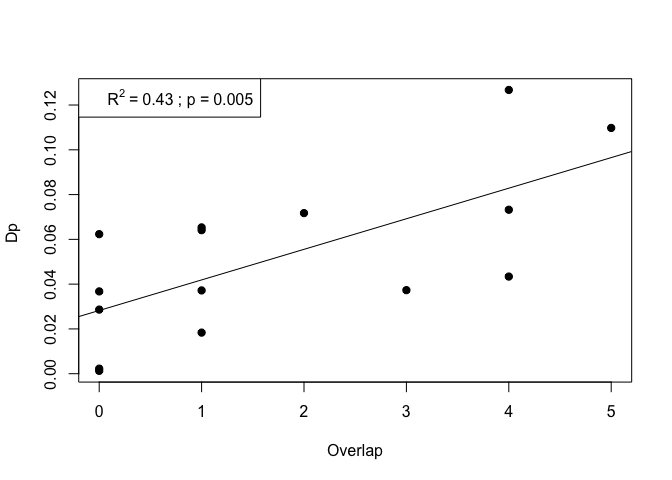
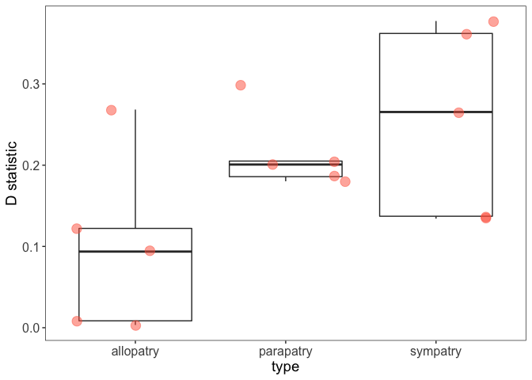

Main analysis
================
Writen by: Ludo Dutoit
8/9/2023

## Load packages and data

``` r
library("ggplot2")
library("ggthemes")
data<-read.table("allBBAA2.txt",h=T)

data<-data[-c(12,15,18),] # 12 15 and 18 for sets2.txt Those had a minimum D value not matching the trees, suggesting possible incongruence on the tree
colnames(data)
```

    ##  [1] "comp_number" "sp1"         "sp2"         "sp3"         "outgroup"   
    ##  [6] "type"        "P1"          "P2"          "P3"          "Dstatistic" 
    ## [11] "Z.score"     "p.value"     "f4.ratio"    "BBAA"        "ABBA"       
    ## [16] "BABA"

## D-statistic across comparison types

``` r
myplot<-ggplot(data = data, mapping = aes(x =type , y = Dstatistic)) +
  geom_boxplot(alpha = 0) +
  geom_jitter(alpha = 0.5, color = "tomato",pch=19,cex=4) 
myplot + theme_bw() + theme( panel.grid.major = element_blank(), panel.grid.minor = element_blank())
```

<!-- -->

``` r
wilcox.test(data$Dstatistic[11:15],(data$Dstatistic[6:10])) # past contact vs allopatry
```

    ## 
    ##  Wilcoxon rank sum test
    ## 
    ## data:  data$Dstatistic[11:15] and (data$Dstatistic[6:10])
    ## W = 4, p-value = 0.09524
    ## alternative hypothesis: true location shift is not equal to 0

``` r
wilcox.test(data$Dstatistic[1:5],(data$Dstatistic[11:15])) # sympatry vs allopatry
```

    ## 
    ##  Wilcoxon rank sum test
    ## 
    ## data:  data$Dstatistic[1:5] and (data$Dstatistic[11:15])
    ## W = 22, p-value = 0.05556
    ## alternative hypothesis: true location shift is not equal to 0

``` r
wilcox.test(data$Dstatistic[1:10],(data$Dstatistic[11:15])) # past contact and sympatry  
```

    ## 
    ##  Wilcoxon rank sum test
    ## 
    ## data:  data$Dstatistic[1:10] and (data$Dstatistic[11:15])
    ## W = 43, p-value = 0.02797
    ## alternative hypothesis: true location shift is not equal to 0

## Include Geographic overlap

``` r
data_overlap<-read.table("allBBAA.j.txt",h=T)

### D-statistic

plot(data_overlap$overlap,data_overlap$Dstatistic,pch=19,xlab = "Overlap",ylab="D statistic")
model<- lm(data_overlap$Dstatistic~data_overlap$overlap)
abline(model) 
R2=round(as.numeric(summary(model)[9]),2)
p=round(as.numeric( (summary(model)$coefficients[8])),2)
legend("topleft",legend=bquote(R^{2}  ~ "=" ~ .(R2) ~ "; p ="~ .(p)))
```

<!-- -->

``` r
summary(model)
```

    ## 
    ## Call:
    ## lm(formula = data_overlap$Dstatistic ~ data_overlap$overlap)
    ## 
    ## Residuals:
    ##       Min        1Q    Median        3Q       Max 
    ## -0.140515 -0.065320  0.001245  0.054092  0.144044 
    ## 
    ## Coefficients:
    ##                      Estimate Std. Error t value Pr(>|t|)   
    ## (Intercept)           0.12436    0.03405   3.652  0.00292 **
    ## data_overlap$overlap  0.03759    0.01390   2.704  0.01805 * 
    ## ---
    ## Signif. codes:  0 '***' 0.001 '**' 0.01 '*' 0.05 '.' 0.1 ' ' 1
    ## 
    ## Residual standard error: 0.09317 on 13 degrees of freedom
    ## Multiple R-squared:   0.36,  Adjusted R-squared:  0.3108 
    ## F-statistic: 7.313 on 1 and 13 DF,  p-value: 0.01805

``` r
summary(lm(data_overlap$Dstatistic~data_overlap$overlap))
```

    ## 
    ## Call:
    ## lm(formula = data_overlap$Dstatistic ~ data_overlap$overlap)
    ## 
    ## Residuals:
    ##       Min        1Q    Median        3Q       Max 
    ## -0.140515 -0.065320  0.001245  0.054092  0.144044 
    ## 
    ## Coefficients:
    ##                      Estimate Std. Error t value Pr(>|t|)   
    ## (Intercept)           0.12436    0.03405   3.652  0.00292 **
    ## data_overlap$overlap  0.03759    0.01390   2.704  0.01805 * 
    ## ---
    ## Signif. codes:  0 '***' 0.001 '**' 0.01 '*' 0.05 '.' 0.1 ' ' 1
    ## 
    ## Residual standard error: 0.09317 on 13 degrees of freedom
    ## Multiple R-squared:   0.36,  Adjusted R-squared:  0.3108 
    ## F-statistic: 7.313 on 1 and 13 DF,  p-value: 0.01805

``` r
### f4
plot(data_overlap$overlap,data_overlap$f4,pch=19,xlab = "Overlap",ylab="F4")
model<- lm(data_overlap$f4~data_overlap$overlap)
abline(model) 
R2=round(as.numeric(summary(model)[9]),2)
p=round(as.numeric( (summary(model)$coefficients[8])),2)
legend("topleft",legend=bquote(R^{2}  ~ "=" ~ .(R2) ~ "; p ="~ .(p)))
```

<!-- -->

``` r
summary(model)
```

    ## 
    ## Call:
    ## lm(formula = data_overlap$f4 ~ data_overlap$overlap)
    ## 
    ## Residuals:
    ##       Min        1Q    Median        3Q       Max 
    ## -0.043446 -0.014212  0.000084  0.014867  0.043453 
    ## 
    ## Coefficients:
    ##                      Estimate Std. Error t value Pr(>|t|)   
    ## (Intercept)          0.028229   0.008980   3.143  0.00777 **
    ## data_overlap$overlap 0.009290   0.003666   2.534  0.02493 * 
    ## ---
    ## Signif. codes:  0 '***' 0.001 '**' 0.01 '*' 0.05 '.' 0.1 ' ' 1
    ## 
    ## Residual standard error: 0.02458 on 13 degrees of freedom
    ## Multiple R-squared:  0.3306, Adjusted R-squared:  0.2792 
    ## F-statistic: 6.422 on 1 and 13 DF,  p-value: 0.02493

``` r
summary(lm(data_overlap$f4~data_overlap$overlap))
```

    ## 
    ## Call:
    ## lm(formula = data_overlap$f4 ~ data_overlap$overlap)
    ## 
    ## Residuals:
    ##       Min        1Q    Median        3Q       Max 
    ## -0.043446 -0.014212  0.000084  0.014867  0.043453 
    ## 
    ## Coefficients:
    ##                      Estimate Std. Error t value Pr(>|t|)   
    ## (Intercept)          0.028229   0.008980   3.143  0.00777 **
    ## data_overlap$overlap 0.009290   0.003666   2.534  0.02493 * 
    ## ---
    ## Signif. codes:  0 '***' 0.001 '**' 0.01 '*' 0.05 '.' 0.1 ' ' 1
    ## 
    ## Residual standard error: 0.02458 on 13 degrees of freedom
    ## Multiple R-squared:  0.3306, Adjusted R-squared:  0.2792 
    ## F-statistic: 6.422 on 1 and 13 DF,  p-value: 0.02493

## Dp statistic

``` r
data$Dp<-abs(data$ABBA-data$BABA)/(data$BBAA+data$ABBA+data$BABA)
cor.test(data$Dp,data$Dstatistic)
```

    ## 
    ##  Pearson's product-moment correlation
    ## 
    ## data:  data$Dp and data$Dstatistic
    ## t = 8.3775, df = 13, p-value = 1.345e-06
    ## alternative hypothesis: true correlation is not equal to 0
    ## 95 percent confidence interval:
    ##  0.7673364 0.9729822
    ## sample estimates:
    ##      cor 
    ## 0.918541

``` r
data_overlap<-read.table("allBBAA.j.txt",h=T)
plot(data_overlap$overlap,data$Dp,pch=19,xlab = "Overlap",ylab="Dp ")
model<- lm(data$Dp~data_overlap$overlap)
abline(model) 
R2=round(as.numeric(summary(model)[9]),2)
p=round(as.numeric( (summary(model)$coefficients[8])),3)
legend("topleft",legend=bquote(R^{2}  ~ "=" ~ .(R2) ~ "; p ="~ .(p)))
```

<!-- -->

``` r
summary(model)
```

    ## 
    ## Call:
    ## lm(formula = data$Dp ~ data_overlap$overlap)
    ## 
    ## Residuals:
    ##       Min        1Q    Median        3Q       Max 
    ## -0.039447 -0.024751  0.000398  0.019209  0.043894 
    ## 
    ## Coefficients:
    ##                      Estimate Std. Error t value Pr(>|t|)   
    ## (Intercept)          0.028232   0.009766   2.891  0.01263 * 
    ## data_overlap$overlap 0.013651   0.003987   3.424  0.00453 **
    ## ---
    ## Signif. codes:  0 '***' 0.001 '**' 0.01 '*' 0.05 '.' 0.1 ' ' 1
    ## 
    ## Residual standard error: 0.02673 on 13 degrees of freedom
    ## Multiple R-squared:  0.4742, Adjusted R-squared:  0.4337 
    ## F-statistic: 11.72 on 1 and 13 DF,  p-value: 0.00453

``` r
#summary(lm(data_overlap$Dstatistic~data$Dp))#
write.table(data,"BBAAwithDp.txt",quote=F,row.names=F,sep="\t")
```

## Main figures

``` r
data$type<-c("sympatry", "sympatry", "sympatry", "sympatry", "sympatry", "parapatry", "parapatry", "parapatry", "parapatry", "parapatry", "allopatry", "allopatry", "allopatry", "allopatry", "allopatry")


library("ggplot2")
```

### Figure 3

``` r
myplot<-ggplot(data = data, mapping = aes(x =type , y = Dstatistic)) +
  geom_boxplot(alpha = 0) +labs(y="D statistic",cex=5)+geom_jitter(alpha = 0.5, color = "tomato",pch=19,cex=4) 
myplot + theme_bw() + theme( panel.grid.major = element_blank(),                            panel.grid.minor = element_blank(),axis.text=element_text(size=12),
                             axis.title=element_text(size=14))
```

<!-- -->

### Figure 6

``` r
data_overlap<-read.table("allBBAA.j.txt",h=T)
data$Dp<-abs(data$ABBA-data$BABA)/(data$BBAA+data$ABBA+data$BABA)
cor.test(data$Dp,data$Dstatistic)
```

    ## 
    ##  Pearson's product-moment correlation
    ## 
    ## data:  data$Dp and data$Dstatistic
    ## t = 8.3775, df = 13, p-value = 1.345e-06
    ## alternative hypothesis: true correlation is not equal to 0
    ## 95 percent confidence interval:
    ##  0.7673364 0.9729822
    ## sample estimates:
    ##      cor 
    ## 0.918541

``` r
data_overlap$Dp<-data$Dp


myplot<-ggplot(data_overlap, aes(x=overlap, Dstatistic )) +
  geom_point(color="orange",pch=19,cex=4,alpha=0.5)+
  geom_smooth(method=lm, se=FALSE,
              color="darkgrey")+labs(y="D statistic",cex=5)

myplot + theme_bw() + theme( panel.grid.major = element_blank(),
    panel.grid.minor = element_blank(),axis.text=element_text(size=12),
                             axis.title=element_text(size=14)) 
```

    ## `geom_smooth()` using formula 'y ~ x'

<!-- -->
